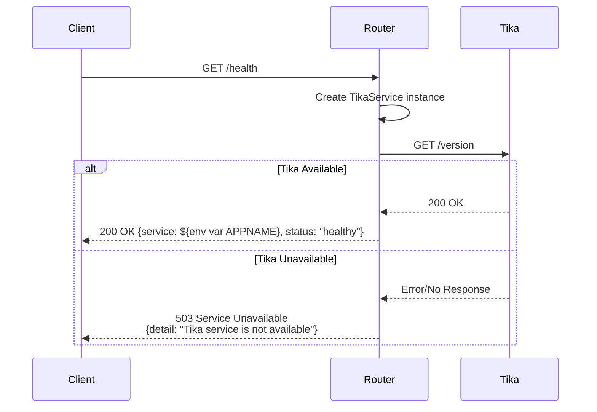
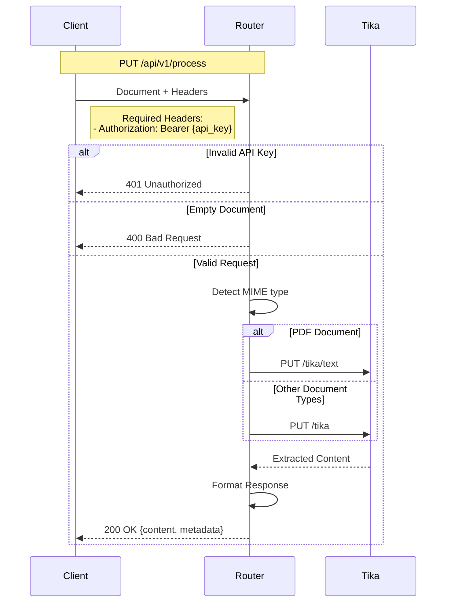

# Document ingestion router

1. [Project description](#project-description)
2. [Installation (production)](#installation-production)
3. [Installation (development)](#installation-development)
4. [Testing the docker image](#testing-the-docker-image)
5. [Environment variables](#environment-variables)
6. [API endpoints](#api-endpoints)

## Project description

This is a FastAPI application to be used to route document loading requests from OpenWebUI to a tika server.

The current [`TikaLoader` class](https://github.com/open-webui/open-webui/blob/5eca495d3e3b3066e7831141ed2adffbd6d179b4/backend/open_webui/retrieval/loaders/main.py#L91) for OWUI:

```python
class TikaLoader:
    def __init__(self, url, file_path, mime_type=None, extract_images=None):
        self.url = url
        self.file_path = file_path
        self.mime_type = mime_type

        self.extract_images = extract_images

    def load(self) -> list[Document]:
        with open(self.file_path, "rb") as f:
            data = f.read()

        if self.mime_type is not None:
            headers = {"Content-Type": self.mime_type}
        else:
            headers = {}

        if self.extract_images == True:
            headers["X-Tika-PDFextractInlineImages"] = "true"

        endpoint = self.url
        if not endpoint.endswith("/"):
            endpoint += "/"
        endpoint += "tika/text"

        r = requests.put(endpoint, data=data, headers=headers)

        if r.ok:
            raw_metadata = r.json()
            text = raw_metadata.get("X-TIKA:content", "<No text content found>").strip()

            if "Content-Type" in raw_metadata:
                headers["Content-Type"] = raw_metadata["Content-Type"]

            log.debug("Tika extracted text: %s", text)

            return [Document(page_content=text, metadata=headers)]
        else:
            raise Exception(f"Error calling Tika: {r.reason}")
```

Sends all documents to the `tika/text` endpoint, but for most documents it is better to use the `tika` endpoint, which return HTML formatted text that can easily be translated to markdown.
The important exception to this is pdf-documents where the plain text endpoint is preferable. [As our simple testing shows](https://github.com/itk-ai/owui_doc_ingestion).

Thus, this is an endpoint built to be used by the [OWUI `ExternalDocumentLoader`](https://github.com/open-webui/open-webui/blob/main/backend/open_webui/retrieval/loaders/external_document.py):

```python
class ExternalDocumentLoader(BaseLoader):
    def __init__(
            self,
            file_path,
            url: str,
            api_key: str,
            mime_type=None,
            **kwargs,
    ) -> None:
        self.url = url
        self.api_key = api_key

        self.file_path = file_path
        self.mime_type = mime_type

    def load(self) -> List[Document]:
        with open(self.file_path, "rb") as f:
            data = f.read()

        headers = {}
        if self.mime_type is not None:
            headers["Content-Type"] = self.mime_type

        if self.api_key is not None:
            headers["Authorization"] = f"Bearer {self.api_key}"

        try:
            headers["X-Filename"] = os.path.basename(self.file_path)
        except:
            pass

        url = self.url
        if url.endswith("/"):
            url = url[:-1]

        try:
            response = requests.put(f"{url}/process", data=data, headers=headers)
        except Exception as e:
            log.error(f"Error connecting to endpoint: {e}")
            raise Exception(f"Error connecting to endpoint: {e}")

        if response.ok:

            response_data = response.json()
            if response_data:
                if isinstance(response_data, dict):
                    return [
                        Document(
                            page_content=response_data.get("page_content"),
                            metadata=response_data.get("metadata"),
                        )
                    ]
                elif isinstance(response_data, list):
                    documents = []
                    for document in response_data:
                        documents.append(
                            Document(
                                page_content=document.get("page_content"),
                                metadata=document.get("metadata"),
                            )
                        )
                    return documents
                else:
                    raise Exception("Error loading document: Unable to parse content")

            else:
                raise Exception("Error loading document: No content returned")
        else:
            raise Exception(
                f"Error loading document: {response.status_code} {response.text}"
            )
```

## Installation (production)

There are two common ways to run this service in production: using Docker or installing the Python package and running with Uvicorn.

Prerequisites:
- A running Apache Tika server reachable from this service (set TIKA_BASE_URL)
- API key to protect this service (API_KEY)
- For Debian/Ubuntu when running without Docker: install libmagic1 (apt install libmagic1)

Option A) Docker (recommended)

- Build image and run with docker-compose using the prod profile:

```bash
docker compose --profile prod up --build -d
```

Environment expected (supply via .env file or environment):
- APP_NAME
- API_KEY
- TIKA_BASE_URL
- Optionally TIKA_USER and TIKA_PASSWORD if your Tika requires auth

The app listens on port 8000 inside the container. Map ports as needed, e.g. with docker run -p 8000:8000 ... if not using compose.

Option B) System install (uv/pip)

- Create and activate a Python 3.11 virtual environment.
- Install the package:

Using uv (preferred if you have uv.lock):
```bash
uv pip install .
```
Using pip:
```bash
pip install .
```

- Ensure libmagic is installed on the host (Debian/Ubuntu: apt install libmagic1)
- Ensure media-types is installed on the host (Debian/Ubuntu: apt install media-types). Required by the fallback detection.
- Provide configuration via environment variables or a .env file (copy .env.example to .env and edit values):

```bash
cp .env.example .env
# edit .env
```

- Run the app with Uvicorn:
```bash
uvicorn app.main:app --host 0.0.0.0 --port 8000
```

## Installation (development)

Prerequisites:
- Python 3.11+
- uv or pip
- Docker (optional, for local Tika)

Steps:
1) Create a virtual environment and install with dev extras:

Using uv:
```bash
uv venv
. .venv/bin/activate
uv pip install -e .[dev]
```
Using pip:
```bash
python -m venv .venv
. .venv/bin/activate
pip install -e ".[dev]"
```

2) Copy environment template and adjust values:
```bash
cp .env.example .env
```

3) Start local Tika and the app using Docker for a full local stack (hot-reload is available when running app locally):
```bash
docker compose --profile dev up --build -d
```
This starts a local Tika at http://localhost:9998 and the app container mounting your code.
Note: The dev Docker Compose profile builds the image with development dependencies (.[dev]) installed via a build-arg.

Alternatively, run the app directly on your host with auto-reload (requires TIKA_BASE_URL to point to a Tika instance):
```bash
uvicorn app.main:app --host 0.0.0.0 --port 8000 --reload
```

4) Run tests:
```bash
docker compose exec app-dev pytest
```

Notes:
- If running on Debian/Ubuntu without Docker, install libmagic1 for MIME detection: apt install libmagic1
- Optional dependencies for development are specified in pyproject.toml under [project.optional-dependencies].

and route the request to the appropriate tika endpoint.

## Development method

This is co-created with the pycharm AI assistant using the Claude 3.5 Sonnet.

- The summary of the project requirements can be seen [here](docs/AI_project_description.md)
- The [AI suggested project structure](docs/AI_project_structure.md)
- The [AI project implementation plan](docs/AI_project_implementation_plan.md)

## Testing the docker image

To test this setup:
1. Build and start the services:
    ``` bash
    docker compose up --build -d
    ```
2. Test the health endpoint:
    ``` bash
    curl http://localhost:8000/health
    ```
3. Test the process endpoint:
    ``` bash
    curl -X PUT \
      http://localhost:8000/api/v1/process \
      -H "Authorization: Bearer <api_key>" \
      -H "Content-Type: text/plain" \
      -d "test content"
    ```
4. And with a pdf test doc
    ``` bash
    curl -X PUT \
      http://localhost:8000/api/v1/process \
      -H "Authorization: Bearer default_dev_key" \
      -H "Content-Type: application/pdf" \
      -H "X-Filename: test.pdf" \
      --data-binary @tests/test_data/aarhusdk_example.pdf
    ```
   
## Environment variables

See [.env.example](.env.example) for the necessary environment variables 

## API Endpoints

### Flow Diagram

Health Check Flow


Document Processing Flow


### Endpoints Details

1. **Health Check**
   - Endpoint: `GET /health`
   - Response: `{"service": "Document Ingestion Router", "status": "healthy"}`
   - No authentication required

2. **Document Processing**
   - Endpoint: `PUT /api/v1/process`
   - Headers:
     - `Authorization: Bearer {api_key}` - Required for authentication
     - `X-Filename: {filename}` - Optional, Name of the file being processed
     - `Content-Type: {mime_type}` - Optional, will be auto-detected if not provided
   - Body: Raw document content
   - Response:
     ```json
     {
       "success": true,
       "content": {
         "page_content": "extracted text content",
         "metadata": {
           "Content-Type": "detected/mime-type",
           "other": "metadata fields"
         }
       }
     }
     ```
   - Error Responses:
     - 401: Invalid or missing API key
     - 400: Empty document or invalid request
     - 500: Processing error
